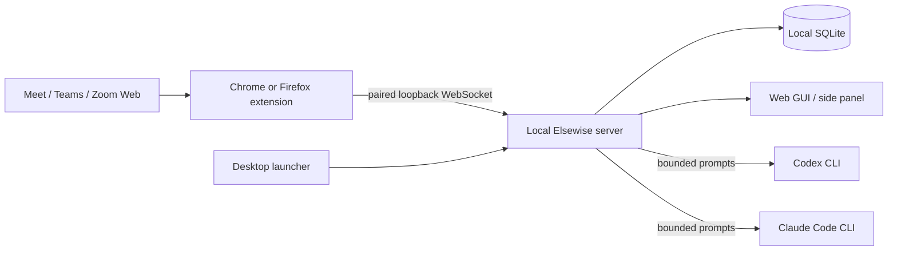
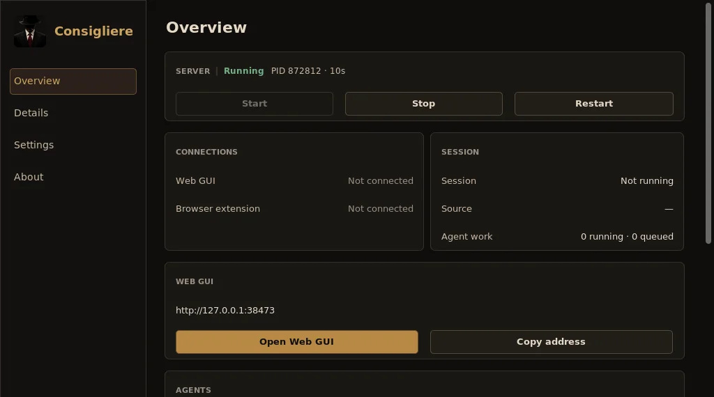
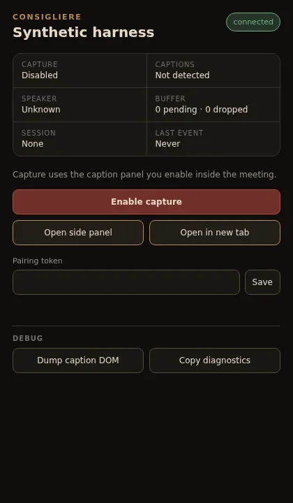

# Elsewise

[](https://github.com/btw-team/elsewise/actions/workflows/ci.yml)
[](https://github.com/btw-team/elsewise/releases/latest)
[](LICENSE)
[](docs/installation.md)

**A local-first meeting companion that turns live browser captions into useful,
context-aware AI assistance while the conversation is still happening.**

This repository contains the free and open-source edition of Elsewise, released
under the Apache License 2.0.

Elsewise captures captions from Google Meet, Microsoft Teams, and Zoom Web,
keeps the transcript and session history on your computer, and lets a locally
installed Codex or Claude Code CLI help with summaries, decisions, follow-up,
technical reasoning, discovery, sales calls, and interviews.


> Elsewise is currently alpha software. Preview builds are unsigned. Read the
> [installation warnings](docs/installation.md#unsigned-preview-builds) before
> running a downloaded artifact.

## Why Elsewise?

- **Useful during the meeting, not only afterwards.** Ask for a catch-up, a concise
  answer, risks, decisions, or the next question without leaving the call.
- **Local session data.** Captions, settings, agent history, and exports remain in
  per-user local storage on your computer.
- **Your agent account.** Elsewise uses the Codex and/or Claude Code CLI already
  installed and authenticated on your machine.
- **Controlled context.** Actions select bounded transcript windows and freeze the
  exact context sent to the agent.
- **Reusable workflows.** Factory presets cover common meetings, and custom actions
  and presets can be created without editing code.
- **One product, three desktop platforms.** The launcher controls a detached local
  server; the same web GUI is available in a tab or browser side panel.

## What can it help with?

| Workflow             | Examples                                                                                |
| -------------------- | --------------------------------------------------------------------------------------- |
| General meetings     | Summaries, decisions, next steps, open questions, risks, catch-up                       |
| Project sync         | Status, blockers, ownership, stakeholder updates                                        |
| Product discovery    | Needs, pain points, requirements, evidence, discovery brief                             |
| Sales calls          | Qualification, objections, commitments, CRM notes                                       |
| Technical review     | Options and trade-offs, decision records, failure modes, implementation plans           |
| Employment interview | Structure truthful answers, recall technical concepts, identify gaps, prepare questions |

The transcript is automatic and may contain recognition errors, fragmented phrases,
or overlapping speech. Elsewise's prompts explicitly tell the agent to reconstruct
meaning cautiously and never invent missing facts.

## How it works



The daemon listens only on `127.0.0.1:38473`. Recording remains available when no
agent CLI is installed or authenticated.

## Install and start

Download the artifact for your platform from
[GitHub Releases](https://github.com/btw-team/elsewise/releases/latest):

- Windows x64: per-user setup executable;
- macOS Apple Silicon or Intel: architecture-specific DMG;
- Ubuntu 22.04+ x64: Debian package or AppImage;
- RPM-based Linux: RPM preview, with the tested baseline stated in each release.

Then:

1. Launch **Elsewise** and start the local server.
2. Install or temporarily load the Chrome/Firefox extension.
3. Copy the pairing token from Settings and save it in the extension popup.
4. Create a session in the web GUI.
5. Enable captions in the meeting tab and enable capture from the extension popup.
6. Start recording and use the selected action preset.

See [Installation](docs/installation.md) and
[Getting started](docs/getting-started.md) for complete platform and pairing steps.

## Product screenshots

| Desktop launcher                                                     | Browser extension                                                         |
| -------------------------------------------------------------------- | ------------------------------------------------------------------------- |
|  |  |

## Privacy and permissions

The open-source edition has no hosted backend. Its local daemon stores transcript
and session data in OS-native per-user directories. Transcript excerpts leave the
machine only when your locally authenticated Codex or Claude Code CLI sends a prompt
to its model provider.

Agent sessions default to a read-only workspace with network access disabled.
Writes and network access must be enabled explicitly. Read the
[privacy and data guide](docs/privacy-and-data.md) before using Elsewise with
sensitive or regulated meetings, and always follow participant-consent rules.

## Documentation

- [Documentation index](docs/index.md)
- [Installation](docs/installation.md)
- [Getting started](docs/getting-started.md)
- [Sessions, actions, and presets](docs/sessions-and-actions.md)
- [Codex and Claude Code](docs/agents.md)
- [Troubleshooting](docs/troubleshooting.md)
- [Developer setup](docs/development/setup.md)
- [Architecture](docs/development/architecture.md)
- [Contributing](CONTRIBUTING.md)

## Origin story

> **Author section:** this space is intentionally reserved for the project's origin
> story. Replace this paragraph with the personal account of how the idea for
> Elsewise appeared and why the project was created.

<!-- AUTHOR: replace the visible placeholder above with the final origin story. -->

## Development quick start

Requirements: Python 3.13, `uv`, Node.js 22+, npm 10+, and Chromium for E2E.

```bash
make install
make install-browsers
make check
uv run elsewise start
uv run elsewise-gui
```

Start with [CONTRIBUTING.md](CONTRIBUTING.md) before opening a pull request.

## License and support

Elsewise is licensed under the [Apache License 2.0](LICENSE). Attribution details
are in [NOTICE](NOTICE), and bundled dependency notices are in
[THIRD_PARTY_NOTICES.md](THIRD_PARTY_NOTICES.md).

If Elsewise is useful to you, you can support its development on
[Ko-fi](https://ko-fi.com/tychh).
