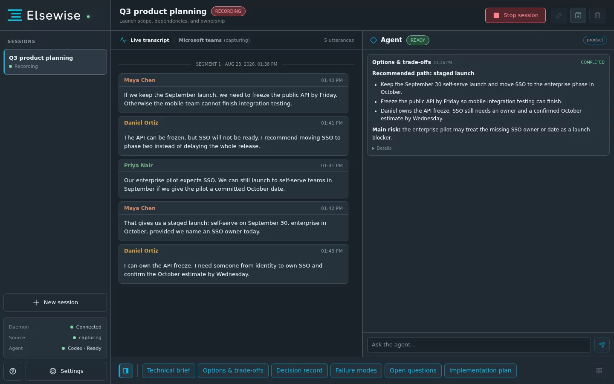
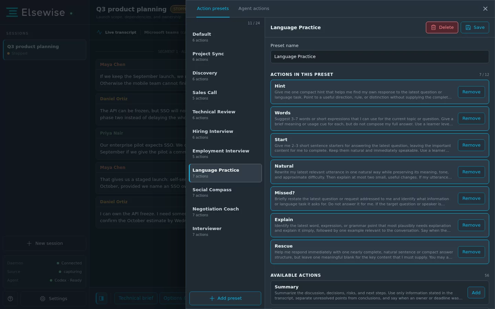
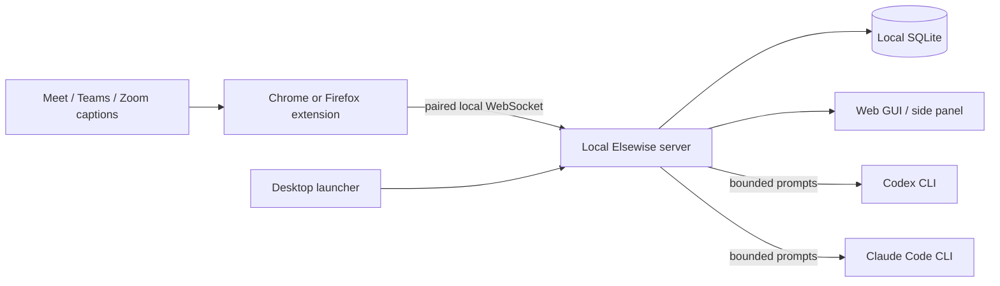

# Elsewise

[](https://github.com/btw-team/elsewise/actions/workflows/ci.yml)
[](https://github.com/btw-team/elsewise/releases/latest)
[](LICENSE)
[](docs/installation.md)

**A real-time AI advisor for live conversations.**

Elsewise keeps up with the conversation and gives you the kind of help you need
in the moment: from recalling information or structuring an answer to spotting
risks, objections, gaps, or the next question to ask.

Elsewise follows captions already displayed by Google Meet, Microsoft Teams, or
Zoom Web and gives you context-aware help while the conversation is happening. It
keeps the live transcript and session history on your computer and works with the
Codex or Claude Code CLI already installed and authenticated on your machine.

This repository contains the free and open-source edition of Elsewise, released
under the Apache License 2.0. Its prompts, actions, and presets are designed to be
adapted to different roles and specialized workflows.



> Elsewise is currently alpha software. Preview builds are unsigned. Read the
> [installation warnings](docs/installation.md#unsigned-preview-builds) before
> running a downloaded artifact.

## See Elsewise in action

A short walkthrough showing several live-conversation workflows is coming soon.

<!-- Replace the sentence above with a linked YouTube thumbnail or video URL. -->

## What makes Elsewise different?

- **Real-time, not post-call.** Elsewise is designed to help while a conversation
  is unfolding, not only summarize it afterwards.
- **Built around your role.** An interview candidate, salesperson, language learner,
  negotiator, and technical lead need different help from the same conversation.
  Presets make that behavior explicit.
- **Continuous context, on-demand AI.** Elsewise follows the conversation as it
  unfolds but calls the agent only when you trigger an action or free prompt. Each
  request receives a bounded, relevant part of the transcript.
- **Yours to adapt.** Actions, prompts, and presets are editable, so one engine can
  support workflows that are specific to your profession, team, or interests.

> **Elsewise is not primarily a recorder or note-taking app.** The transcript is
> context. The product is the assistance built on top of it.

## What can it help with?

| Situation                       | What Elsewise can do                                                                                                    |
| ------------------------------- | ----------------------------------------------------------------------------------------------------------------------- |
| **Employment interviews**       | Help structure an answer, recall relevant experience or technical concepts, and identify what the interviewer is asking |
| **Language practice**           | Give hints, recall words and grammar, and help you continue without simply answering for you                            |
| **Personal conversations**      | Read conversational signals cautiously, recall context, and consider low-pressure ways to respond                       |
| **Sales calls**                 | Suggest follow-up questions and surface objections, qualification gaps, and commitments                                 |
| **Technical discussions**       | Recall context, compare approaches, and surface trade-offs and failure modes                                            |
| **Negotiations**                | Track interests, constraints, leverage, concessions, and possible responses                                             |
| **Journalism and interviewing** | Detect unanswered points, contradictions, and promising threads; suggest the next question                              |
| **Work meetings**               | Catch you up, summarize decisions, surface risks, and extract next steps                                                |

These are examples, not fixed product modes. Elsewise can be reshaped through its
preset and action model without changing the application itself.

## Presets change how Elsewise helps

A preset defines the kind of assistance you want during a conversation and exposes
a small set of purpose-built actions. Each action is a one-click request with its
own prompt and precisely controlled conversation context.

For example:

- **Employment Interview** offers actions such as _Tech answer_, _My answer_,
  _Role check_, and _Handle gap_.
- **Language Practice** offers _Hint_, _Words_, _Natural_, _Explain_, and _Rescue_.
- **Negotiation Coach** offers _Interests_, _My leverage_, _Counteroffer_, and
  _Conceding?_.
- **Interviewer** offers _Follow up_, _Go deeper_, _Mismatch?_, and _Next question_.

The same moment in a conversation can therefore invite very different assistance:
an interviewee may choose _My answer_, an interviewer _Go deeper_, a language
learner _Hint_, and a negotiator _My leverage_.

> **No prompt engineering in the middle of a conversation.** Configure the workflow
> once, then use short, focused actions when you need them.

Built-in presets provide useful starting points. You can edit their actions or
create a focused workflow of your own in the web GUI. See
[Sessions, actions, and presets](docs/sessions-and-actions.md).



## How it works

1. The extension watches captions already rendered by Meet, Teams, or Zoom Web.
2. The local Elsewise server maintains the live transcript and conversation state.
3. When you trigger an action or free prompt, Elsewise sends the selected context
   and instruction to your configured Codex or Claude Code CLI.

Caption capture keeps the local context current, but no AI request is made until
you explicitly ask for help.



Caption capture and recording continue when no agent CLI is available. Automatic
captions may contain recognition errors, fragmented phrases, or overlapping speech,
so built-in prompts tell the agent to reconstruct meaning cautiously and never
invent missing facts.

## Quick start

1. **Download Elsewise** for Windows, macOS, or Linux from the
   [latest GitHub Release](https://github.com/btw-team/elsewise/releases/latest).
2. **Install and authenticate Codex or Claude Code** if you want AI assistance.
   Recording and export work without an agent CLI.
3. **Start Elsewise, load the browser extension, and pair it** with the token shown
   in Settings.
4. **Open a supported conversation, enable its captions, create a session, and
   enable capture.** Choose a preset action or send a free prompt when you need help.

The [installation guide](docs/installation.md) covers platform packages and unsigned
preview warnings. [Getting started](docs/getting-started.md) walks through pairing,
capture, sessions, and the first action.

## Local-first OSS architecture

- Elsewise itself has no hosted application backend.
- Transcripts, sessions, settings, agent history, and exports stay on your machine.
- Only the prompt and bounded context you ask the agent to process pass through your
  locally authenticated Codex or Claude Code provider.
- Agent workspace writes and network-capable tools are disabled by default and must
  be enabled explicitly for a session.

Read [Privacy and local data](docs/privacy-and-data.md) before using Elsewise with
sensitive or regulated conversations, and always follow participant-consent rules.

## Current alpha limitations

- Elsewise captures captions rendered by the meeting platform; it does not
  transcribe microphone or system audio itself.
- Capture currently supports Google Meet, Microsoft Teams Web, and Zoom Web.
- AI assistance currently requires an installed and authenticated Codex or Claude
  Code CLI.
- Caption adapters depend on browser UI that meeting platforms can change without
  notice. Such changes can temporarily break capture.
- Caption quality is platform-dependent. In current testing it has been strongest
  on Meet, usable but less consistent on Teams, and substantially less reliable on
  Zoom, especially outside English. See [Meeting capture](docs/meeting-capture.md).
- Presets stay local to one Elsewise installation; built-in community sharing and
  discovery are not available yet.

## Who is this for?

The current OSS release is aimed primarily at technical users who are comfortable
installing local software and agent CLIs. Once configured, Elsewise itself is
designed to be used through presets and one-click actions during ordinary
conversations. It is intentionally hackable: prompts, actions, and presets are
meant to be inspected and changed.

## Build your own Elsewise

A preset is a reusable conversational workflow. Create one for a profession, hobby,
conversation type, or personal process, then combine only the actions and context
windows that role needs.

- [Design actions and presets](docs/sessions-and-actions.md#design-your-own-workflow)
- [Understand agent permissions and context](docs/agents.md)
- [Contribute a workflow, adapter, or product improvement](CONTRIBUTING.md)

## Origin story

I started building Elsewise for my own employment interviews. The hard part was not
usually that I had never learned the material. After years of hands-on software
work, it was still difficult to understand a question under pressure, retrieve the
right piece of practical experience or technical knowledge within seconds, and
turn it into a clear response while the conversation kept moving.

I realized that this problem was not unique to interviews. A salesperson,
interviewer, language learner, negotiator, and engineer each need a different kind
of help in the moment, but the underlying capture, context, and agent infrastructure
can be the same. Elsewise grew from that insight: one real-time advisor whose
behavior changes with your role and intent.

## Product direction

Elsewise is alpha software and these directions do not carry release dates, but the
current architecture is intended to grow toward:

- system-audio capture and a local speech-to-caption/utterance pipeline;
- more local agents, model providers, and execution backends;
- easier preset sharing and community-built conversational workflows;
- broader capture sources and conversation environments beyond browser meetings.

## Documentation

- [Documentation index](docs/index.md)
- [Installation](docs/installation.md)
- [Getting started](docs/getting-started.md)
- [Sessions, actions, and presets](docs/sessions-and-actions.md)
- [Codex and Claude Code](docs/agents.md)
- [Privacy and local data](docs/privacy-and-data.md)
- [Troubleshooting](docs/troubleshooting.md)
- [Architecture](docs/development/architecture.md)

## Development and contributing

Contributions are welcome, especially for conversation-platform adapters,
presets/actions, documentation, and the backend or frontend itself. Start with
[CONTRIBUTING.md](CONTRIBUTING.md) before opening a pull request.

Requirements: Python 3.13, `uv`, Node.js 22+, npm 10+, and Chromium for E2E.

```bash
make install
make install-browsers
make check
uv run elsewise start
uv run elsewise-gui
```

## License and support

Elsewise is licensed under the [Apache License 2.0](LICENSE). Attribution details
are in [NOTICE](NOTICE), and bundled dependency notices are in
[THIRD_PARTY_NOTICES.md](THIRD_PARTY_NOTICES.md).

If Elsewise is useful to you, you can support its development on
[Ko-fi](https://ko-fi.com/tychh).
