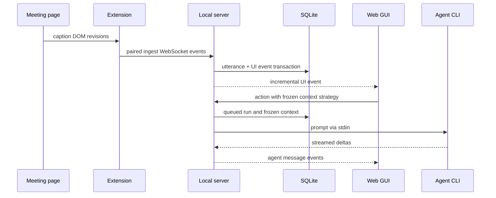

# Architecture

## Components

The product ships as three cooperating surfaces:

1. A Python daemon owns canonical state, SQLite, capture ingestion, agent queues,
   exports, and REST/WebSocket APIs.
2. A React web GUI consumes a bounded global snapshot, selected-session detail,
   cursor history, and live UI events.
3. One TypeScript browser extension builds separate Chrome and Firefox MV3 outputs
   and captures captions through platform adapters.

The CustomTkinter launcher is a separate process that controls the detached daemon
through private loopback runtime endpoints. Closing the launcher does not normally
stop the server.

## Data flow

## Persistence and recovery

The single initial Alembic migration creates the current pre-release schema and
factory actions/presets. Startup order is migration, crash recovery, retention and
pruning, optional VACUUM, then agent queue startup.

Caption payloads are not stored in rejected/orphan diagnostics. Canonical utterance
and its UI outbox event are committed in one transaction.

## Live API

`GET /api/snapshot` contains global bounded state. Selecting a session loads
`GET /api/sessions/{id}/detail`; older utterances and agent history use opaque
cursors. The UI applies simple events directly and resyncs on reconnect, a pruned
cursor, or an unknown/complex event.

Global settings expose `ui_theme` as `"dark" | "light"` through
`GET/PATCH /api/settings`. The same field is present in `/api/runtime/status` and
the runtime WebSocket payload consumed by the launcher. Saving settings emits a
`settings.changed` UI event, prompting the web GUI to refresh immediately. The web
GUI uses `elsewise-ui-theme` in `localStorage` only as a first-paint cache; the
server value remains authoritative. The extension deliberately uses the same key
in its independent `browser.storage.local` namespace.

## Extension pairing

Pairing is DB-backed and scoped to a browser installation. A short-lived,
nonce-bound WebSocket carries request status and delivers a per-client credential
exactly once after approval. Only its digest is persisted.

The local pairing API is:

| Method | Path                                  | Behavior |
| ------ | ------------------------------------- | -------- |
| `GET` | `/api/pairing/requests` | Lists pending requests. |
| `POST` | `/api/pairing/requests/{id}/approve` | Approves one request. |
| `POST` | `/api/pairing/requests/{id}/deny` | Denies one request. |
| `GET` | `/api/paired-clients` | Lists paired browsers. |
| `PATCH` | `/api/paired-clients/{id}` | Renames one client. |
| `DELETE` | `/api/paired-clients/{id}` | Revokes one client. |

The extension keeps its credential in local browser storage and sends it only in the
initial protocol-v2 `client.hello`. Revocation closes that client's sockets without
affecting other paired browsers.

## Agent threads

Every session has at most one provider-specific thread. Provider changes are locked
after first start. The queue freezes context at enqueue time and routes create,
resume, cancel, and shutdown through the provider registry.

See [Stable API errors](api-errors.md) and
[Extension adapters](extension-adapters.md).
