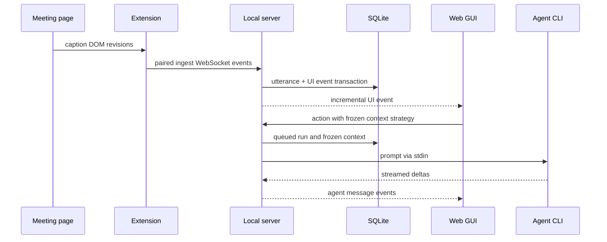

# Architecture

## Components

The product ships as three cooperating surfaces:

1. A Python daemon owns canonical state, SQLite, capture ingestion, agent queues,
   exports, and REST/WebSocket APIs.
2. A React web GUI consumes a bounded global snapshot, selected-session detail,
   cursor history, and live UI events.
3. One TypeScript browser extension builds separate Chrome and Firefox MV3 outputs
   and captures captions through platform adapters.

The CustomTkinter launcher is a separate process that controls the detached daemon
through private loopback runtime endpoints. Closing the launcher does not normally
stop the server.

## Data flow

## Persistence and recovery

The single initial Alembic migration creates the current pre-release schema and
factory actions/presets. Startup order is migration, crash recovery, retention and
pruning, optional VACUUM, then agent queue startup.

Caption payloads are not stored in rejected/orphan diagnostics. Canonical utterance
and its UI outbox event are committed in one transaction.

## Live API

`GET /api/snapshot` contains global bounded state. Selecting a session loads
`GET /api/sessions/{id}/detail`; older utterances and agent history use opaque
cursors. The UI applies simple events directly and resyncs on reconnect, a pruned
cursor, or an unknown/complex event.

## Extension pairing

The server and launcher share `PairingManager` over `pairing.json` in the resolved
per-user config directory. Both call `ensure()` at startup, so the first component
to run creates the credential and subsequent starts reuse it. Writes are atomic,
owner-only on POSIX platforms, and coordinated between processes by a file lock.

The local pairing API is:

| Method | Path                                  | Behavior |
| ------ | ------------------------------------- | -------- |
| `GET`  | `/api/extension/pairing`              | Returns the current token and metadata for local Settings. |
| `PUT`  | `/api/extension/pairing`              | Trims and saves a manually supplied 16–4096 character token. |
| `POST` | `/api/extension/pairing/regenerate`   | Generates, saves, and returns a random replacement token. |

The extension keeps the token in local browser storage and sends it in the initial
`client.hello` frame to `ws://127.0.0.1:38473/ws/ingest`. The server first validates
the extension origin and then compares the credential in constant time. Each token
change increments its generation; an established ingest connection is rejected as
soon as it sends another frame under an older generation. Saving the unchanged token
does not increment the generation.

The pairing credential is distinct from the runtime control token and is never sent
in a URL or emitted to logs.

## Agent threads

Every session has at most one provider-specific thread. Provider changes are locked
after first start. The queue freezes context at enqueue time and routes create,
resume, cancel, and shutdown through the provider registry.

See [Stable API errors](api-errors.md) and
[Extension adapters](extension-adapters.md).
